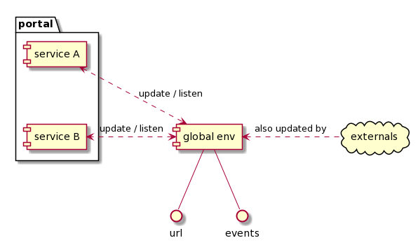
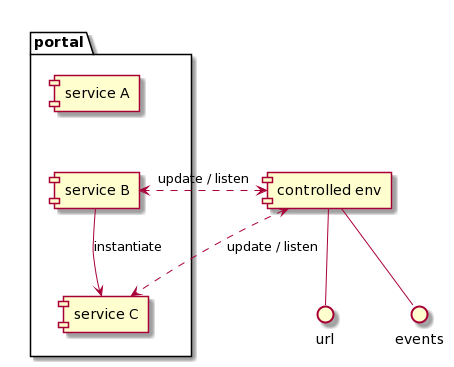

# front-components - compose different frontend microservices

Compose different microfrontend in a portal.

You can either instantiate a service as uncontrolled: it has access to browser url, and a global event bus provided by this package.


Or you can instantiate a service as controlled by another one: it has access to a scoped router, and a scoped event bus


## Install

TODO - wait for a name

## Registering a service

Service A should register itself as soon as it can, and provide:

- a unique identifier
- a way to mount this service on DOM
- a way to unmount this service

```javascript
import { registerInstance } from "front-components";

function mount(domElement) {
  // ... For exemple: ReactDOM.render(..., domElement)
}

function unmount(domElement) {
  // ... For exemple: ReactDOM.unmountComponentAtNode(domElement);
}

registerInstance({
  serviceId: "service-A",
  mount,
  unmount,
});
```

## Instantiating a service

Load your service from you portal or another service, using its unique identifier.
If service is in a local file you can use `require`, if it's on remote file you can use `<script>` tag or even systemJs:

- instantiate an uncontrolled service with: `instantiateAt('service-A', domElement);`
- instantiate an controlled service with: `instantiateAt('service-A', domElement, { isControlled: true });`

## Events

To emit and listen to events from a service or portal:

```javascript
import { emit, on } from "front-components";

emit("my-event");
on("my-event", (data) => console.log(data));
```

## Location

A service should not directly access `window.location` and other `history` related stuff.
Instead, it should gain access to navigation history using a plugin.
For example, for React-router, you can use history from our plugin:

```javascript
import { getReactRouterHistory } from "front-components-history";

const history = getReactRouterHistory();
// uncontrolled service => history will be browser history
// controlled service => history will be memory history
```

## Basic usage

Some exemple with React.

### Portal instantiate uncontrolled service

An uncontrolled service emit and listen to events in global bus.
Portal has access to global event bus.

```javascript
// ... service-a/index.js
import { emit } from "front-components";
import { getReactRouterHistory } from "front-components-history";

function mount(domElement) {
  // This will be browser history as service is uncontrolled
  const history = getReactRouterHistory();

  ReactDOM.render(<App history={history} />, domElement);
  emit("hello", { foo: "bar" });
}

function unmount(domElement) {
  ReactDOM.unmountComponentAtNode(domElement);
}

registerInstance({
  serviceId: "service-A",
  mount,
  unmount,
});

// ... portal/index.js
import { instantiateAt, on } from "front-components";

// Listen to global events
on("mounted", (data) => {
  console.log(data); // Once service-a will be mounted, this will be logged
});

// Instantiate service A
const div = document.getElementById("root");
instantiateAt("service-A", div).then(() => {
  console.log("service A instantiated");

  document.location = "new-url"; // will redirect service A
});
```

### Portal instantiate controlled service

An controlled service emit and listen to events in a scoped event bus.
Portal has no direct access to this event bus.
Portal can retrieve service event bus after service has been mounted.

```javascript
// ... service-b/index.js
import { emit } from "front-components";

function mount(domElement) {
  // This will be a memory history as service is controlled
  const history = getReactRouterHistory();

  ReactDOM.render(<App history={history} />, domElement);
  emit("hello", { foo: "bar" });
}

function unmount(domElement) {
  ReactDOM.unmountComponentAtNode(domElement);
}

registerInstance({
  serviceId: "service-b",
  mount,
  unmount,
});

// ... portal/index.js
import { instantiateAt, on } from "front-components";

// Listen to global events
on("mounted", (data) => {
  console.log(data); // This will never print, as service b is controlled
});

// Instantiate service B
const div = document.getElementById("root");
instantiateAt("service-B", div).then((controls) => {
  controls.events.on("an-event-from-service-b", (data) => {
    console.log(data); // This will print next time service b emit an event
  });

  // will move service B to a specific location, independant of browser url
  controls.history.push("/service-b-specific-url");
});
```
